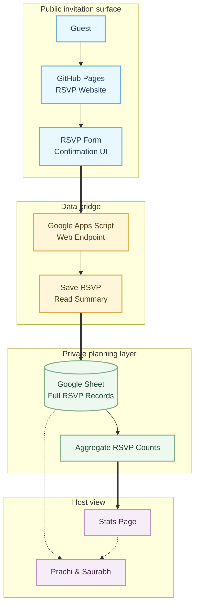

# Baby Shower RSVP



```text
Public layer: invitation and RSVP experience
Bridge layer: form submission and summary access
Private layer: full RSVP records
Host layer: planning view and aggregate stats
```
